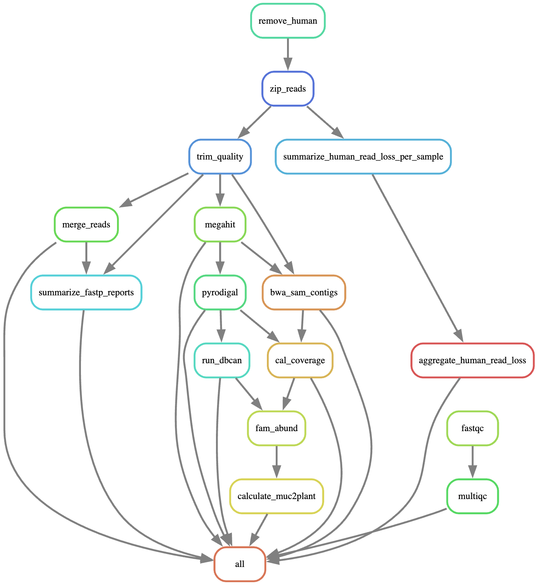

# Muc2plant Snakemake Pipeline

A reproducible Snakemake workflow for calculating the mucin to plant CAZyme ratio from 150 bp PE shotgun metagenomic sequencing data. Written by Sarah E. Blecksmith (Lemay Lab, UC Davis, USDA) and built from the [metagenomics processing pipeline](https://github.com/nithyak2/lemaylab_metagenomics_pipeline) developed by Nithya K. Kumar (Lemay Lab, UC Davis, USDA).

In this pipeline, CAZyme genes are annotated with dbcan.

Jinfang Zheng, Qiwei Ge, Yuchen Yan, Xinpeng Zhang, Le Huang, and Yanbin Yin. Dbcan3: automated carbohydrate-active enzyme and substrate annotation. *Nucleic Acids Research*, pages gkad328, 2023

The dbcan team has extensive documentation available at:

<https://run-dbcan.readthedocs.io/en/latest/index.html>

They also have a Nextflow pipeline available:

<https://run-dbcan.readthedocs.io/en/latest/nextflow/index.html>

Their workflow has been adapted here in Snakemake in order to build off the Lemay Lab metagenomic analysis pipeline created by Nithya K. Kumar.

------------------------------------------------------------------------

## Overview

This pipeline streamlines the analysis of shotgun metagenomic sequencing data.\
It performs quality control, removes host reads, profiles microbial taxa, and summarizes results in a reproducible and modular framework.

**Core features:** - Automated workflow management using **Snakemake** - Reproducible environments using **Conda** - Modular structure for easy extension - Example configuration for quick setup

------------------------------------------------------------------------

## Workflow Summary

| Step                   | Tool                  | Description                          |
|------------------------|-----------------------|--------------------------------------|
| 1\. Quality control    | FastQC                | Assess read quality                  |
| 2\. Host read removal  | Bowtie2               | Remove host reads                    |
| 3\. Trimming           | Fastp                 | Trim adapters and low-quality bases  |
| 4\. Merging            | Fastp                 | Merge paired end reads               |
| 5\. Assembly           | Megahit               | Assemble into contigs                |
| 6\. Gene calling       | Pyrodigal             | Predicts genes                       |
| 7\. CAZyme annotation  | run_dbcan             | Identify CAZymes with dbcan database |
| 8\. Read mapping       | bwa, samtools         | Map contigs back to reads            |
| 9\. Calculate coverage | dbcan_utils           | Count reads per gene                 |
| 10\. Family abundance  | dbcan_utils           | Outputs CAZyme family abundance      |
| 11\. Muc2plant         | calculate_muc2plant.R | Calculates mucin to plant ratio      |

## Snakemake rulegraph



------------------------------------------------------------------------

## Instructions

1.  Clone the repository

``` bash
git clone https://github.com/sblecksmith/muc2plant_pipeline
cd muc2plant_pipeline
```

2.  Copy config/config_muc2plant.yaml and edit the paths for your system. **This should be the only file you need to edit, you should not need to edit the Snakefile**

3.  Create sample sheet (sample_sheet.txt) with columns: sample_name, long sample, r1_path, r2_path

    Use the code below, also in scripts/make_sample_sheet.sh

``` bash
# To auto-generate from fastq_files directory, run:
# edit this based on your file names 
# Create the sample sheet from your existing files
 echo -e "sample_name\tlong_sample\tr1_path\tr2_path" > sample_sheet.txt
 for r1 in fastq_files/*_R1_001.fastq.gz; do
     r2="${r1/_R1_/_R2_}"
     sample=$(basename "$r1" | sed 's/_S[0-9]*_L[0-9]*_R1_001.fastq.gz//')
     long_sample=$(basename "$r1" | sed 's/_R1_001.fastq.gz//')
     echo -e "${sample}\t${long_sample}\t${r1}\t${r2}" >> sample_sheet.txt
 done
 
# Example output:
# Tab-separated file with these columns:
# sample_name   long_sample r1_path r2_path
# 109_C1_E  109_C1_E_S18_L006   fastq_files/109_C1_E_S18_L006_R1_001.fastq.gz   fastq_files/109_C1_E_S18_L006_R2_001.fastq.gz
# 109_C1_N  109_C1_N_S66_L006   fastq_files/109_C1_N_S66_L006_R1_001.fastq.gz   fastq_files/109_C1_N_S66_L006_R2_001.fastq.gz
```

Note: The "long_sample" column is required for the fastqc rule. If your raw fastq files do not have these added characters, you can simply make the long_sample column identical to the sample_name column. This is a quick fix so you don't need to modify the variable calls in downstream rules.

4.  Load snakemake v9.11.4 into a conda environment (if necessary):

``` bash
eval "$(mamba shell hook --shell bash)"
mamba create -n snakemake_env -c conda-forge -c bioconda snakemake=9.11.4
conda activate snakemake_env
```

5.  Install slurm executor plugin for snakemake v8+ (only needs to be done once), specify version:

``` bash
pip install snakemake-executor-plugin-slurm==1.9.0
```

6.  Install the dbcan databases

    This can be done manually or using the rundbcan database command. Please see the rundcan documentation for complete installation instructions.

    <https://run-dbcan.readthedocs.io/en/latest/user_guide/prepare_the_database.html>

    Not all of the databases are required for calculating muc2plant but downloading them all with rundbcan database is preferred to ensure they are set up correctly.

    The databases should be in a db folder under the project root. The path is specified in the config file.

7.  Quick check to make sure there are no errors (dry run):

``` bash
snakemake -s scripts/Snakefile --configfile config/config_muc2plant.yaml -n
```

8.  Run the pipeline using one of these methods (meant for using HPC with SLURM scheduler):

-   METHOD A - Submit via sbatch script (recommended):

``` bash
sbatch scripts/submit_snakefile.sh
```

-   METHOD B - Run in terminal directly.

``` bash
snakemake -s scripts/Snakefile --configfile config.yaml --executor slurm --jobs 20 \
--use-conda --default-resources slurm_partition=GROUPNAME mem_mb=4096 runtime=600
```

9.  Monitor progress:

``` bash
tail -f logs/snakemake_controller<jobid>.out
```

## REQUIRED DIRECTORY STRUCTURE:

```         
project_root/
│
├── config/
│   └── config.yaml                [REQUIRED - edit with your paths]
│
├── scripts/
│   ├── Snakefile_muc2plant.py     [this file]
│   ├── submit_snakefile.sh        [submit this file with sbatch]
│   ├── make_sample_sheet
│   └── calculate_muc2plant.R
│
├── db/
|   ├── CAZy.dmnd    
│   ├── dbCAN-PUL/       
│   ├── dbCAN-PUL.xlsx
|   ├── dbCAN-sub.hmm    
│   ├── dbCAN.hmm       
│   ├── fam-substrate-mapping.tsv
|   ├── peptidase_db.dmnd    
│   ├── PUL.dmnd       
│   ├── sulfatlas_db.dmnd
|   ├── TCDB.dmnd    
│   ├── TF.dmnd       
│   ├── TF.hmm
│   
|
├── envs/
│   ├── fastqc_multiqc.yaml
│   ├── bowtie.yaml
│   ├── fastp.yaml
│   ├── metaphlan.yaml
│   ├── megahit.yaml
│   ├── pyrodigal.yaml
│   ├── bwa.yaml
│   ├── samtools.yaml
│   ├── rundbcan.yaml
│   └── dbcan_utils.yaml
│
├── sample_sheet.txt              [REQUIRED - tab-separated file with sample info]
│
└── fastq_files/                  [your input files]
    ├── sample1_R1.fastq.gz
    ├── sample1_R2.fastq.gz
    ├── sample2_R1.fastq.gz
    └── sample2_R2.fastq.gz

All output directories will be created automatically by Snakemake
```
